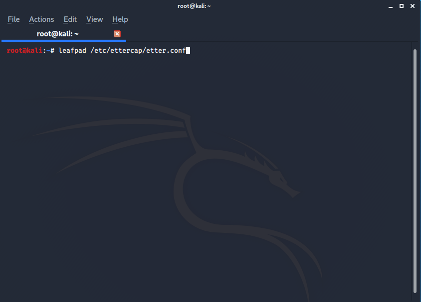
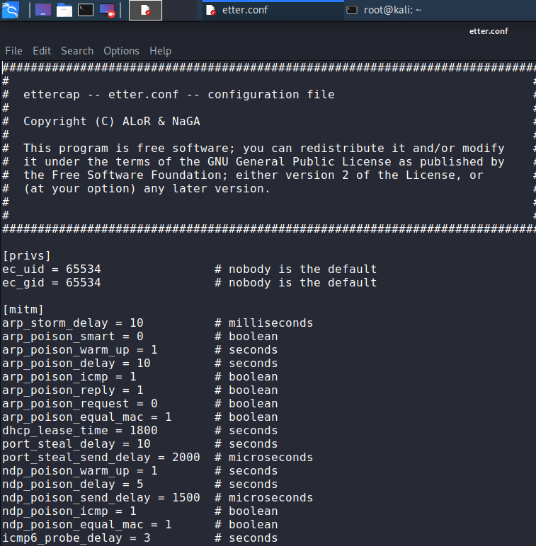
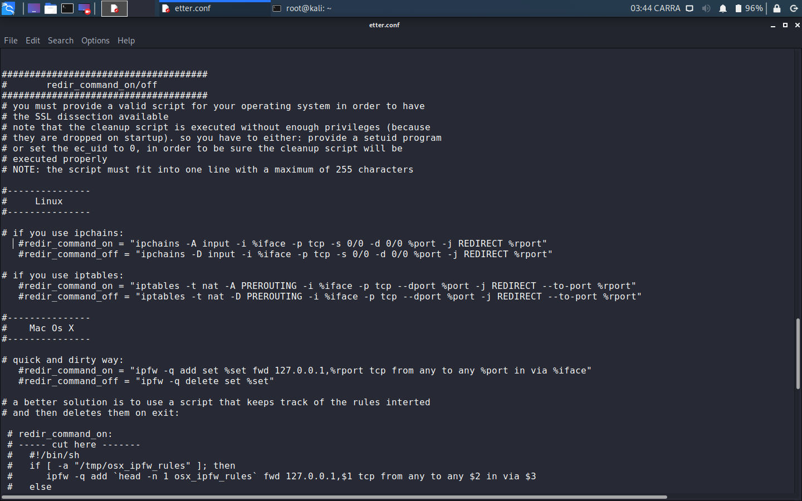
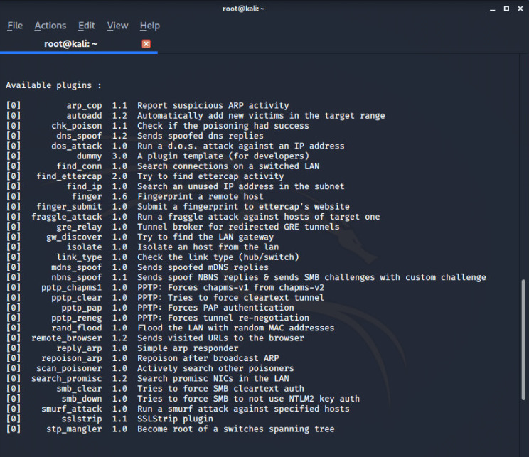
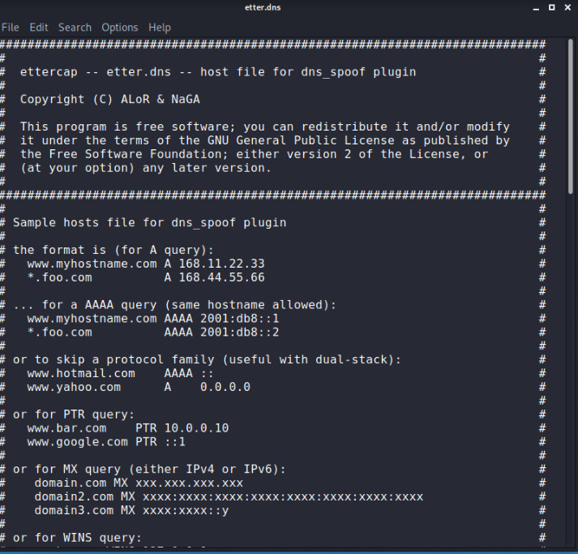
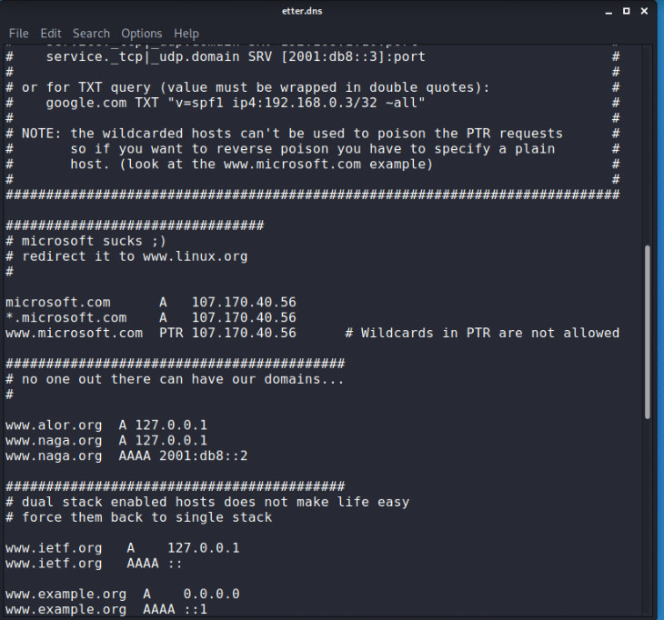
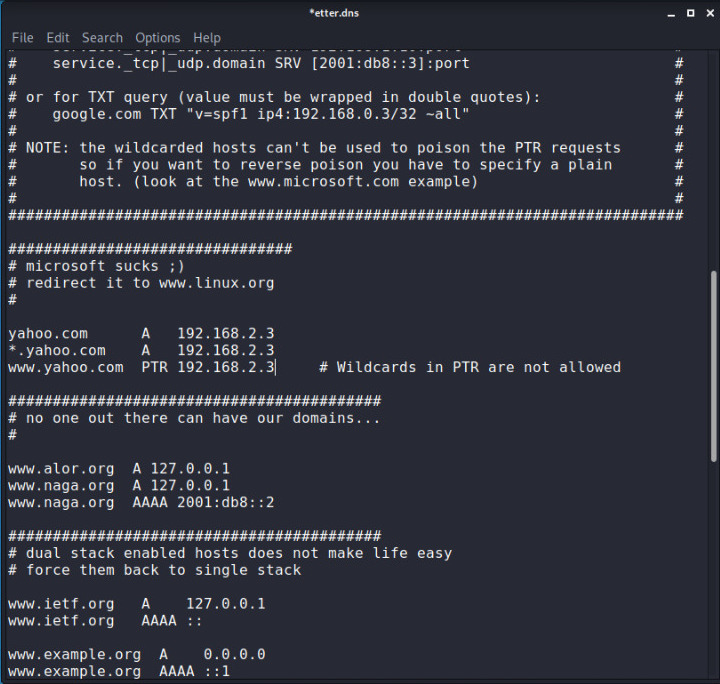
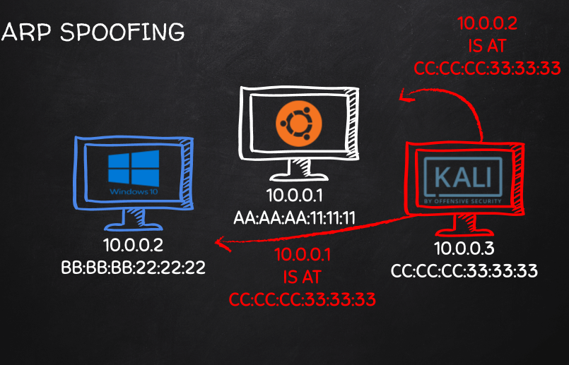

# ETTERCAP


This writeup is about the tool **ettercap** that can be used in many **POST CONNECTION ATTACKS** so post-connections attacks works against Wifi & Ethernet both, in this attacks you can manually capture data and bypass HTTPs and some router-side security features you can also analyse data flows.

#### So why only  ettercap ?

>Its a cool tool for MITM attacks with basic but reliable features it has in sniffer supports plugins for dns spoofing and it has many custom filters.

Let's begin with this tools but you need to  customize it a little bit before diving into main features which will help you in future work:

**Open bash and write**



the .conf file for ettercap will open



**set ec_uid: 0 and ec_gid: 0** (because it gives warning sometimes) and than scroll down



you will find iptables just uncomment those two lines by removing # from staring save and quit the terminal we are ready to go for attack.

Run:

```bash
root@kali:~# ettercap --help

(it list all possible features to use with device)

root@kali:~# ettercap -Tq ///

```


-T is used to run in text mode and q is for silent mode and  /// is for all devices so always read --help for each and every tool its very helpful, It scans all the devices connected to the same network.

You can press h once again after tool scans all the hosts so list all hosts by [lL] you can quit the tool just by pressing 'q' in bash now lets try **ARP Spoof** using ettercap many of you will think we can use the classic 'mitm arp spoof ...'
but since ettercap gives lots of features so let's give it chance.

**NOTE: We are illustrating the attack using eth0 you can use your desired interface like wlan0  or remember that the first three value of ip addresses for your target IP will be same as yours as you are connected to same network**

Usage: ettercap [options] [TARGET1] [TARGET2]

```bash
root@kali:~# ettercap -Tq -M arp:remote -i eth0 /(IP ADDRESS OF GATEWAY)// /(IP ADDRESS OF TARGET)//

```

```bash
root@kali:~# ettercap -Tq -M arp:remote -i eth0 /10.0.2.1// /10.0.2.5//

```
---
**BREAKDOWN FOR COMMAND :**

IP ADDRESS OF GATEWAY: address of router to which you are connected which you can get just by the command 'route-n ' in bash you will also get this address in host blacklist

IP ADDRESS OF TARGET: select the device you want to attack from host list scanned by the ettercap from above command.

**why /// ?**

(MAC ADDRESS)/(IP ADDRESS)/(IPv6)

our job can be only by using  IP Address's

After running the command just confirm GROUP1 and GROUP2 are set perfectly the tool will do the arp-spoofing attack and it will starts the sniffer automatically and if the victim visit any http websites all data will flow through your computer and data will be displayed on your bash

---

Lets talk about how to downgrade HTTPs to HTTP using SSLstrip and ettercap follow the below steps:

1. Flush iptables
2. Add iptables rule to redirect packets to sslstrip

```bash
root@kali:~# iptables -t nat -A PREROUTING -p tcp --destination-port 80 -j REDIRECT --to-port 10000
root@kali:~# sslstrip --help

```
(Traffic comes to default port of tcp @ 80 and since we will be the man in the middle we are redirecting those traffic our default port 10000 )


3. Start sslstrip

```bash
root@kali:~# sslstrip

```
4. Start ettercap to poison target. (in another TAB)

```bash
root@kali:~# ettercap -Tq -M arp:remote eth0  /10.0.2.1// /10.0.2.5//

```
Hit ENTER that's all.

---

I already told that we are using ettercap because of some cool feature and on the feature is **plugins** like autoadd,repoison_arp,dns_spoof and many more.

>autoadd: If you are attacking to whole subnet and some clients are connecting to the network after your run attack so you can't posison but this plugins help to overcome this problem it keep running background and help to add them in your attack.

Here we are targeting whole network connected to our Wifi

```bash
root@kali:~# ettercap -Tq -M arp:remote -i wlan0 -S ///

```
See your host's list after this  you can press **p** to see all plugins



From the list of plugins just select the plugin you want to add.

```bash
Plugin name (0 to quit ) :autoadd

```
Hit Enter to activate and now when new client you will be notified, try some more plugins by yourself just type and activate it.


---
##### DNS SPOOFING (with ettercap)

In short DNS Spoofing helps to redirect requests from one website to another you can send the request to your own sever for more details either read the [Wikipedia](https://en.wikipedia.org/wiki/DNS_spoofing) or our writeups on DNS Spoofing.

For this also we are going to use the dns_spoof plugin but before this you need to make some change to etter.dns file

```bash
root@kali:~# leafpad /etc/ettercap/etter.dns

```
file will be opened in leafpad



Scroll down a little bit you will find something like this change url and ip configuration(see from ifconfig) and set the desired url you want to spoof.



For example i will spoof my victim when he tries to open yahoo



You will be redirecting the user to your own server so run your apache.

```bash
root@kali:~# service apache2 start
root@kali:~#ettercap -Tq -M arp:remote -i wlan0 -S -P dns_spoof/(TARGET IP)//  /(GATEWAY IP)//

```
---

Lets talk about one more feature of ettercap which is **one way spoofing** before diving i want to make you realise why we need this so at first lets  know briefly  about the ARP spoofing : In this attack the attacker pretends to be router for the victim by taking router's MAC Address and for router the attacker acts as victim by taking its MAC Address and hence attacker become the man in the middle between router and victim but if the sys admin or victim is using any tool to prevent **ARP Spoofing** then they will find there are **two IP Addresses** which are having the same **MAC Address** this can expose us to overcome this we need **one way spoofing**

So in one way spoofing we only fool victim by pretending to be router so any requests from victim will pass through the attacker machine but response goes directly to victim from access point(router) here we will not able to manipulate the responses because we are not fooling the but still all necessary data will flow through the attacker machine you can downgrade the https and also use DNS_spoofing.

COMMAND FOR ONE WAY SPOOFING:
```
root@kali:~# ettercap -Tq -M arp:oneway -i eth0 -S /(Victims IP )// /(ROUTERS IP)//

```

```
root@kali:~# ettercap -Tq -M arp:oneway -i eth0 -S /10.0.2.5// /10.0.2.1//

```

>Thats it all the responses will flow throuh your macine  but sometimes ettercap sniffers not work effeciently (in the case of one way spoofing) so you can use **Wireshark/Tshark** and use the filter http to get all requests.


**AUTHOR** - [ERROR](https://github.com/Error-200)
